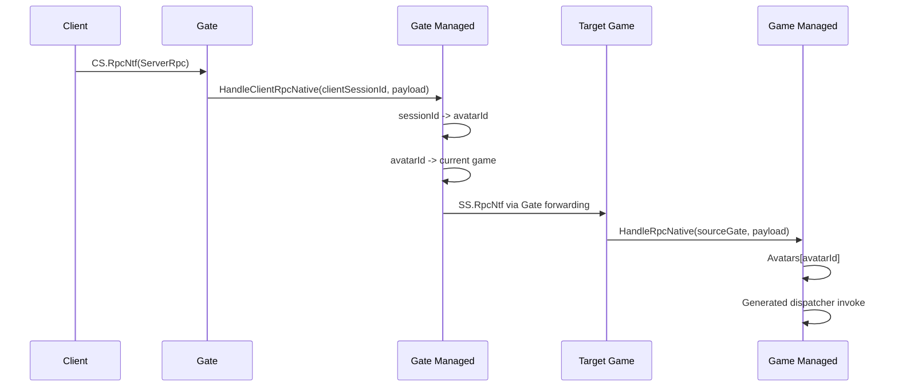
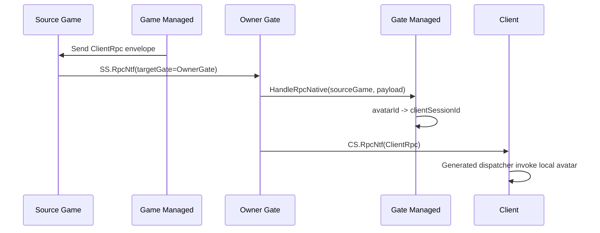
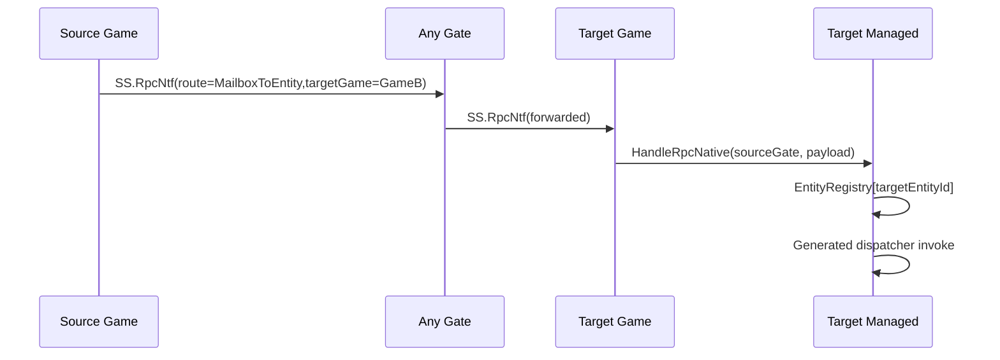
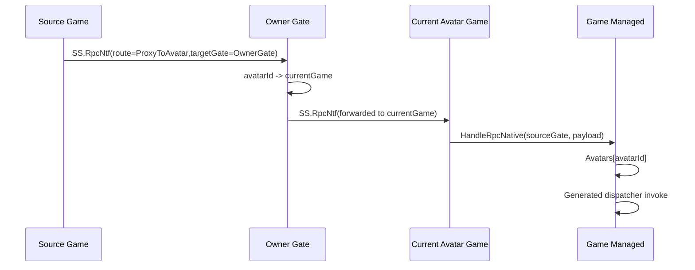
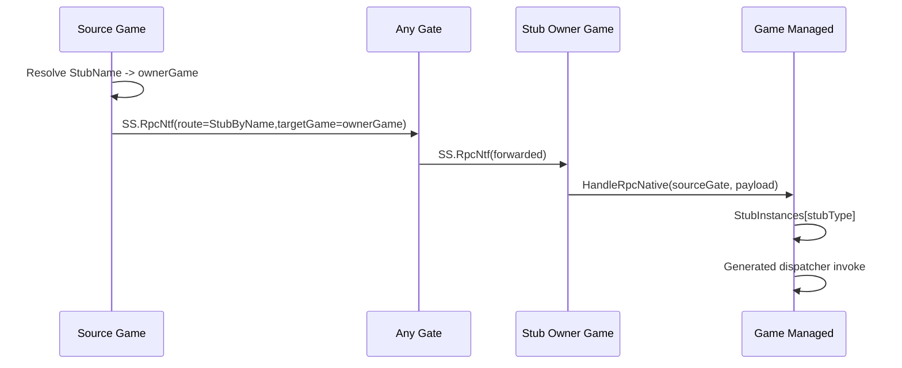

# DEGF RPC Link Design

本文档描述 DEGF 框架第一版 RPC 链路设计。设计基于当前项目已有的客户端 KCP 通道、服务端 Engine 内网通道、nethost 托管运行时桥接、分布式 Entity/Avatar/Stub 结构。

## 设计结论

第一版 RPC 只支持单向调用，不支持返回值、异常回传、超时、取消和自动重试。所有 RPC 方法必须通过 Attribute 显式暴露。RPC 调用代码和分发代码直接由现有 `DE.Share.EntityPropertySG` Source Generator 扩展生成，不采用运行时反射分发作为第一版机制。

服务器集群路由严格遵守 Game 节点之间不直连的架构约束。任何 Game 到 Game 的 RPC 都必须经过 Gate 转发。

RPC 覆盖四类场景：

1. Client 和 Server 之间同一个 Avatar 的 RPC。
2. 通过 Mailbox 对远端 ServerEntity 发起 RPC。
3. 通过 Proxy 对可能迁移的远端 Avatar 发起 RPC。
4. Server 端直接通过 StubName 对 Stub 发起 RPC。

## 术语

### RPC Method

被 Attribute 标记、允许远程调用的普通 `void` 方法。

```csharp
[ServerRpc]
public void UseSkill(int skillId)
{
}

[ClientRpc]
public void OnSkillUsed(int skillId)
{
}
```

第一版只允许返回类型为 `void`。Generator 对非 `void` 方法直接报编译错误。

### Mailbox

Mailbox 是一个普通远端 ServerEntity 的定位引用，包含目标实体当前所在的 Game 节点。

```csharp
public readonly struct EntityMailbox
{
    public Guid EntityId { get; }
    public string GameServerId { get; }
    public string EntityTypeKey { get; }
}
```

Mailbox 的语义是：调用方已经知道目标当前所在 Game。任意一个 Gate 都可以作为中转 Gate，将 RPC 转发到 Mailbox 中记录的目标 Game。

Mailbox 不解决迁移。目标实体迁移后，旧 Mailbox 可以失败，由上层重新获取新的 Mailbox。

### Avatar Proxy

Proxy 是专门面向 Avatar 迁移场景的远端 Avatar 引用。它不直接信任某个 Game 节点，而是包含 Avatar 所属 Gate。

```csharp
public readonly struct AvatarProxy
{
    public Guid AvatarId { get; }
    public string OwnerGateServerId { get; }
}
```

Proxy 调用链路必须转发到特定 OwnerGate。OwnerGate 根据本地 Avatar 路由表确认该 Avatar 当前所在 Game，再继续转发到最终 Game。

Proxy 的目标是解决 Avatar 迁移造成的 Game 位置变化，而不是作为普通 ServerEntity Mailbox 的替代品。

### StubName

StubName 是业务可读的 Stub 短名，例如 `OnlineStub`、`MatchStub`、`SpaceStub`。内部仍可使用当前 `ServerStubDistributeTable` 的 TypeKey 做唯一标识。

如果短名冲突，启动时应直接报错，要求业务显式指定别名或改名。

## Attribute 设计

建议新增 RPC Attribute 到共享层，客户端和服务端都能引用。

```csharp
namespace DE.Share.Rpc
{
    [AttributeUsage(AttributeTargets.Method, Inherited = true, AllowMultiple = false)]
    public sealed class ServerRpcAttribute : Attribute
    {
    }

    [AttributeUsage(AttributeTargets.Method, Inherited = true, AllowMultiple = false)]
    public sealed class ClientRpcAttribute : Attribute
    {
    }
}
```

建议语义如下：

| Attribute | 允许目标 | 主要调用方 |
| --- | --- | --- |
| `ServerRpc` | Server 端 Avatar、ServerEntity、ServerStubEntity | Client 或 Server |
| `ClientRpc` | Client 端 Avatar | Server |

第一版只保留 `ServerRpc` 和 `ClientRpc`。所有服务端实体上的远程方法都统一标记为 `ServerRpc`，由路由类型决定调用目标是 Avatar、普通 ServerEntity 还是 Stub。

## Source Generator 设计

RPC 生成器直接扩展现有 `DE.Share.EntityPropertySG` 项目，而不是新增单独生成器项目。

### Generator 输入

Generator 扫描以下目标：

1. 标记了 RPC Attribute 的方法。
2. 方法所在类型必须是 `Entity`、`EntityComponent`、`ServerEntity`、`ServerStubEntity`、`ClientEntity` 或 Avatar 派生类型。
3. 方法必须是实例方法。
4. 方法必须返回 `void`。
5. 方法不能是泛型方法。
6. 参数类型必须属于 RPC 序列化白名单。

第一版参数白名单建议：

| 类型 | 支持状态 |
| --- | --- |
| `bool` | 支持 |
| `byte` / `sbyte` | 支持 |
| `short` / `ushort` | 支持 |
| `int` / `uint` | 支持 |
| `long` / `ulong` | 支持 |
| `float` / `double` | 支持 |
| `string` | 支持，UTF-8 |
| `Guid` | 支持，16 字节 |
| enum | 支持，按底层整数 |
| `byte[]` | 支持 |
| struct/class DTO | 第一版不支持，后续通过接口扩展 |

### Generator 输出

Generator 对每个含 RPC 方法的 partial 类型生成：

1. RPC 方法元数据表。
2. `MethodId -> invoke` 的分发 switch。
3. 强类型发送代理方法。
4. 参数序列化代码。
5. 参数反序列化代码。

示例输出形态：

```csharp
public partial class DemoAvatarEntity
{
    public static void RegisterGeneratedRpc(DE.Share.Rpc.RpcRegistry registry)
    {
        registry.Register(typeof(DemoAvatarEntity), 0x12345678u, InvokeGeneratedRpc);
    }

    private static bool InvokeGeneratedRpc(object target, uint methodId, RpcBinaryReader reader)
    {
        var entity = (DemoAvatarEntity)target;
        switch (methodId)
        {
            case 0x12345678u:
            {
                var skillId = reader.ReadInt32();
                entity.UseSkill(skillId);
                return true;
            }
            default:
                return false;
        }
    }

    public void SendUseSkill(int skillId)
    {
        var writer = new RpcBinaryWriter();
        writer.WriteInt32(skillId);
        RpcRuntime.SendAvatarServerRpc(this.Guid, 0x12345678u, writer.ToArray());
    }
}
```

实际命名需避免污染业务方法名，建议统一使用 `__DEGF_RPC_*` 前缀。

### MethodId 生成

MethodId 必须稳定。建议输入包含：

```text
DeclaringType.FullName + "." + MethodName + "(" + ParameterTypeFullNames + ")"
```

然后计算 `uint32` hash。Generator 在同一编译内检测冲突。若冲突，报编译错误，并允许后续增加 Attribute 显式指定 Id。

建议保留 `MethodName` 只用于日志和诊断，不作为执行依据。

## RPC Envelope

所有链路共用统一 Envelope。Engine 只负责识别和转发，业务语义由托管层处理。

```text
RpcEnvelope
- Version: ushort
- TargetKind: byte
- RouteKind: byte
- SourceServerId: string
- SourceEntityId: Guid
- TargetEntityId: Guid
- TargetEntityTypeKey: string
- TargetGameServerId: string
- TargetGateServerId: string
- TargetStubName: string
- MethodId: uint
- MethodName: string
- ArgsPayload: byte[]
```

`TargetKind` 建议枚举：

```text
Avatar
ServerEntity
Stub
```

`RouteKind` 建议枚举：

```text
ClientToAvatar
AvatarToClient
MailboxToEntity
ProxyToAvatar
StubByName
```

第一版不需要 `CallId`，因为明确只做 `void` 且不支持 reply。可以保留协议扩展位，但不要在运行时代码中引入未使用状态机。

## 消息号规划

为了减少 Engine 对业务 RPC 类型的理解，建议只新增通用 RPC 消息号。

CS 消息：

```text
CS.RpcNtf = 0x00010006
```

SS 消息：

```text
SS.RpcNtf = 0x00020009
SS.RpcForwardNtf = 0x0002000A
```

含义：

| 消息号 | 用途 |
| --- | --- |
| `CS.RpcNtf` | Client 到 Gate，或 Gate 到 Client 的客户端链路 RPC |
| `SS.RpcNtf` | Server 节点收到后交给本节点 managed runtime 处理 |
| `SS.RpcForwardNtf` | Gate 作为转发节点使用，Envelope 内仍包含最终目标 |

也可以只使用 `SS.RpcNtf`，由 Gate 收到后根据 Envelope 决定本地处理还是继续转发。第一版建议少加消息号，优先统一。

## 路由规则

### Client -> Server Avatar RPC

客户端只能调用自己 Avatar 上允许的 `ServerRpc`。



安全约束：

1. 客户端不得决定最终 AvatarId。Gate 必须根据 `clientSessionId` 查询已登录 Avatar。
2. Gate 必须根据 Avatar 路由表定位当前 Game。
3. Game 侧必须校验目标方法是允许客户端调用的 `ServerRpc`。

### Server Avatar -> Client RPC

服务器调用客户端 Avatar 上允许的 `ClientRpc`。



这里依赖 Gate 保存：

```text
AvatarId -> ClientSessionId
AvatarId -> CurrentGameServerId
```

Game 保存：

```text
AvatarId -> OwnerGateServerId
```

### Mailbox -> ServerEntity RPC

Mailbox 包含目标所在 Game。调用方任选一个 Gate 转发即可。



Mailbox 路由失败时只记录失败，不自动迁移查找。

### Proxy -> Avatar RPC

Proxy 面向 Avatar 迁移。Proxy 包含 OwnerGate，不包含可信的当前 Game。



迁移期间建议行为：

1. OwnerGate 是 Avatar 路由权威。
2. Avatar 迁移开始时，OwnerGate 可将 Avatar 标记为 `Migrating`。
3. 第一版遇到 `Migrating` 可拒绝并记录日志。
4. 后续可以在 OwnerGate 做短暂排队，迁移完成后继续投递。

### StubName -> Stub RPC

StubName 先解析到负责该 Stub 的 Game，然后仍通过 Gate 转发。



如果 Stub 就在本 Game，是否仍必须经过 Gate 有两个选择：

1. 本地优化：直接调用本地 Stub。
2. 严格统一：仍走 Gate。

建议第一版允许本地优化，因为没有违反 Game 与 Game 不直连；目标就是本进程。

## Gate 路由职责

Gate 是所有跨 Game RPC 的中转点。为了支持 Mailbox、Proxy、Client RPC，Gate 至少需要维护以下状态：

```text
AvatarId -> ClientSessionId
AvatarId -> CurrentGameServerId
AvatarId -> RouteState
```

`RouteState` 建议：

```text
Online
Migrating
Offline
```

对于 Proxy RPC：

1. 收到目标 Gate 为自身的 Envelope。
2. 查询 `AvatarId -> CurrentGameServerId`。
3. 如果 Online，转发到当前 Game。
4. 如果 Migrating，第一版拒绝或记录。
5. 如果 Offline，拒绝并记录。

对于 Mailbox RPC：

1. Envelope 中已有 TargetGameServerId。
2. Gate 不查 Avatar 表。
3. 直接转发到 TargetGameServerId。

对于 Client RPC：

1. Envelope 中有 TargetGateServerId 或 AvatarId。
2. Gate 查询 AvatarId 对应 ClientSessionId。
3. 通过 ClientNetwork 下发 `CS.RpcNtf`。

## Game 路由职责

Game 负责实体实例和本地执行：

```text
Guid -> ServerEntity
Guid -> AvatarEntity
Type -> ServerStubEntity
StubName -> ServerStubEntity
```

建议新增统一 EntityRegistry：

```csharp
public sealed class EntityRegistry
{
    public bool TryGetEntity(Guid entityId, out ServerEntity entity);
    public void Add(ServerEntity entity);
    public void Remove(Guid entityId);
}
```

Avatar 可以继续保留专用 `Avatars` 字典，但应和 EntityRegistry 同步注册。

## Native Bridge 扩展

Managed 调 Native：

```csharp
NativeAPI.SendRpcToGate(string gateServerId, byte[] envelope)
NativeAPI.SendRpcToGameViaGate(string gateServerId, string targetGameServerId, byte[] envelope)
NativeAPI.SendRpcToClient(ulong clientSessionId, byte[] envelope)
```

Native 调 Managed：

```csharp
ManagedAPI.HandleClientRpcNative(ulong clientSessionId, IntPtr payload, int payloadSizeBytes)
ManagedAPI.HandleServerRpcNative(IntPtr sourceServerId, IntPtr payload, int payloadSizeBytes)
```

也可以先收敛成两个底层函数：

```csharp
NativeAPI.SendServerRpc(string targetServerId, byte[] envelope)
NativeAPI.SendClientRpc(ulong clientSessionId, byte[] envelope)
```

但因为 Game 不能直连 Game，托管侧最好显式表达 `via Gate`，避免业务误用。

## Engine 扩展

Engine 侧需要做三类工作：

1. 新增 CS/SS RPC 消息号。
2. Gate 收到客户端 `CS.RpcNtf` 后交给 Gate managed runtime。
3. Gate 收到服务器 `SS.RpcNtf` 后根据 Envelope 转发到 Game 或 Client。

Game 节点不允许直接向另一个 Game 节点发送 RPC。Game 发起跨 Game RPC 时，必须调用发送到 Gate 的 Native API。Native API 可以默认选择一个可用 Gate，或者由上层显式传入 Gate。

Mailbox 场景可以选择任意 Gate：

```text
Source Game -> Selected Gate -> Target Game
```

Proxy 场景必须选择 Proxy.OwnerGate：

```text
Source Game -> OwnerGate -> Current Avatar Game
```

## 权限和错误处理

第一版建议实现以下硬校验：

1. RPC 方法必须是 `void`。
2. RPC 方法必须由 Attribute 标记。
3. Client -> Server 只能调用当前 session 绑定的 Avatar。
4. Client -> Server 只能调用 `ServerRpc`。
5. Server -> Client 只能调用 `ClientRpc`。
6. Mailbox 和 Proxy 只能调用目标实体上的 `ServerRpc`。
7. StubName 只能调用目标 Stub 上的 `ServerRpc`。
8. 参数解码失败不执行方法。
9. 目标实体不存在不创建实体。
10. 业务方法异常必须 catch 并记录，不能穿透到网络循环。

## 第一版实施阶段

### 阶段 1：共享 RPC 协议和 Generator

产出：

1. RPC Attribute。
2. `RpcEnvelope`。
3. `RpcBinaryWriter` / `RpcBinaryReader`。
4. `DE.Share.EntityPropertySG` 扩展生成 RPC dispatch 和强类型发送入口。
5. 单元测试覆盖 MethodId 稳定性、参数编码、非法方法诊断。

该阶段不接网络，只验证生成代码可编译、可本地调用 dispatcher。

### 阶段 2：StubName RPC

产出：

1. StubName 注册表和冲突检测。
2. 本地 Stub 直接调用。
3. 远端 Stub 经 `Game -> Gate -> Game` 转发。

这是最适合先落地的端到端链路，因为它不依赖客户端登录态，也不依赖 Avatar 迁移。

### 阶段 3：Mailbox RPC

产出：

1. `EntityMailbox`。
2. Game 侧 EntityRegistry。
3. Mailbox 经任意 Gate 转发到目标 Game。

该阶段解决普通远端 ServerEntity 调用。

### 阶段 4：Client <-> Server Avatar RPC

产出：

1. Client 侧 Avatar RPC 发送和分发。
2. Gate 侧 session 到 Avatar 路由校验。
3. Server 侧 Avatar `ServerRpc` 执行。
4. Server 到 Client 的 `ClientRpc` 下发。

该阶段需要补齐登录后的 Avatar 路由状态。

### 阶段 5：Avatar Proxy RPC

产出：

1. `AvatarProxy`。
2. OwnerGate Avatar 路由权威表。
3. Proxy 经特定 OwnerGate 查询当前 Game 后转发。
4. 迁移状态下的拒绝或排队策略。

该阶段和 Avatar 迁移强相关，建议在基础 RPC 已稳定后再实现。

## 推荐起步顺序

建议从阶段 1 和阶段 2 开始：

1. 先完成 Generator 和通用 RPC payload。
2. 再做 StubName RPC 打通 `Game -> Gate -> Game` 的严格链路。

理由：

1. StubName 不依赖客户端。
2. StubName 不依赖 Avatar 迁移。
3. StubName 会迫使 Engine、NativeBridge、Managed Runtime 三层先形成通用 RPC 通道。
4. 后续 Mailbox 和 Proxy 只是增加不同的路由解析策略。

## 待后续扩展

第一版明确不做以下功能，但协议设计不应阻断后续加入：

1. RPC 返回值。
2. 异步 RPC。
3. 超时。
4. 调用取消。
5. 自动重试。
6. 迁移期间 Gate 排队。
7. DTO 自动序列化。
8. RPC 压缩。
9. RPC 加密或签名。
10. 运行时 RPC 统计和 tracing。
